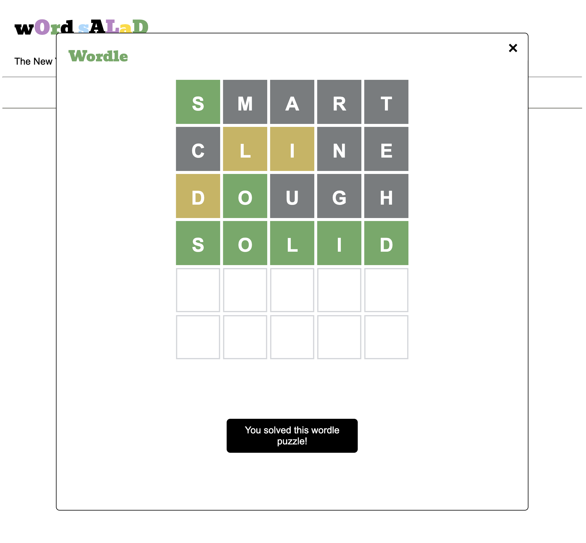
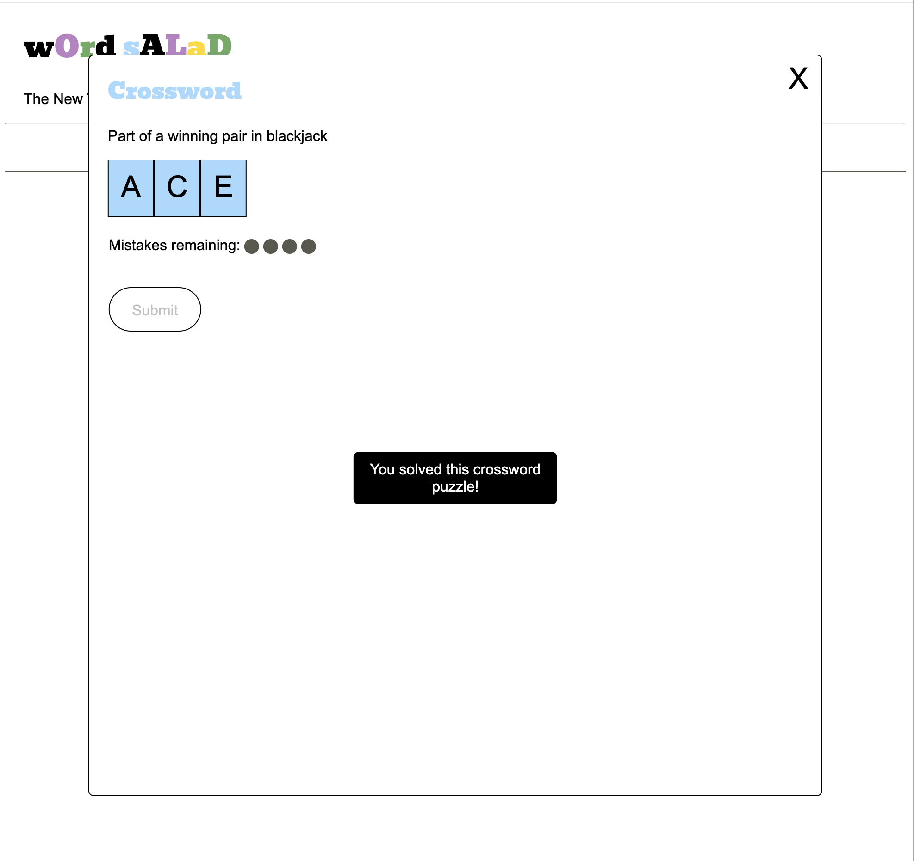

# Word Salad

Word Salad is a loving homage to the most popular puzzles from The New York Times. It combines Connections, Wordle, and the crossword into a single Frankenstein's monster mashup of a game.

## Getting Started

1. Clone this repo.
2. Open `index.html` in the browser.

## Built with

* JavaScript
* Handlebars
* HTML
* CSS

## How to Play

The board is comprised of 16 cards. Some of the cards already have words on them. Some of the cards contain a puzzle that you'll need to solve to reveal the word.


<br>

**1. Click on a blank card to open a puzzle. The puzzle will be either a Wordle or a crossword. Solve the puzzle to reveal the word.**



  

<br>

**2. After all the words have been revealed, select a group of four cards that have something in common.**


<br>

**3. If you select the correct group of cards, a category will be revealed.**


<br>

**4. Continue selecting groups of four cards until you've found all the categories.**


## Features
### Connections
**Solving puzzles**
* After you solve a puzzle, the word will appear on the card in black text.
* If you don't solve the puzzle, the word will appear on the card in red text.

**Selecting cards**
* You can only select four cards at a time.
* You can't guess the same set of cards twice.
* You can make up to three incorrect attempts to guess all the categories.

---

### Wordle
* When you submit a word, tile colors change to show you how close you are to getting the correct word.
  * Green - The letter is in the correct position
  * Yellow - The word contains that letter but it is in the incorrect position
  * Gray - The word does not contain that letter
* You can't guess the same word twice.
* The word you submit must be in the Wordle dictionary.

---

### Crossword
* You can't guess the same word twice.
* You have four chances to guess a word.

## Potential Roadmap

- [ ] Game summary that shows number of wordles, crosswords, and connections solved
- [ ] More robust Crossword
  - [ ] After each guess, show the letters that are correct
  - [ ] User can't enter a new value for letters that are correct
- [ ] After the connections game has been played, the board flips over and turns into different puzzles:
  - [ ] Sudoku
  - [ ] Spelling Bee
  - [ ] Strands
- [ ] User can close an incomplete puzzle and continue solving it
- [ ] More robust animations
- [ ] Game data is stored in database
- [ ] Track usage data

## Answer Key

```
GAME 1

CORE: [HEART (wordle), CRUX (crossword clue: "Gist"), ESSENCE, SUBSTANCE]

COMPLICATED: [MESSY (wordle), BAROQUE (crossword clue: "Music style popularized by Bach"), COMPLEX, ELABORATE]

SYMBOLS USED IN MAKING LISTS: [ARROW (wordle), BULLET (crossword clue: "Muggsy Bogues or Manute Bol, once), CHECKBOX, HYPHEN]

WHAT 'CROSS' MIGHT MEAN: [ANGRY (wordle), CRUCIFIX (crossword clue: "One of those 'T' necklaces, maybe"), BETRAY, HYBRID]
```
```
LATIN WORDS: [CARPE (wordle), QUID (crossword clue: "A pound across the pond, perhaps"), ERGO, VOX]

PACK (AWAY) FOR FUTURE USE: [STORE (wordle), SQUIRREL (crossword clue: "________ Nut Zippers"), STASH, STOW]

________ GAME: [SQUID (wordle), ARCADE (crossword clue: "where you might find Ms. Pac-Man"), BLAME, NUMBERS]

ADJECTIVES FOR ASSETS: [TOXIC (wordle), FROZEN (crossword clue: "Ice cold"), FIXED, LIQUID]
```
```
HIGHLY SKILLED: [ADEPT (wordle), ACE (crossword clue: "Part of a winning pair in blackjack"), MAESTRO, HOTSHOT]

KINDS OF CAKE: [POUND (wordle), CRUMB (crossword clue: "The soft part of bread"), MARBLE, BIRTHDAY]

TANGIBLE: [SOLID (wordle), MATERIAL (crossword clue: "Half of a moniker for Madonna"), CONCRETE, REAL]

THINGS YOU CAN THROW IN METAPHORS: [PARTY (wordle), WRENCH (crossword clue: "To pull or twist"), CURVEBALL, TANTRUM]
```
